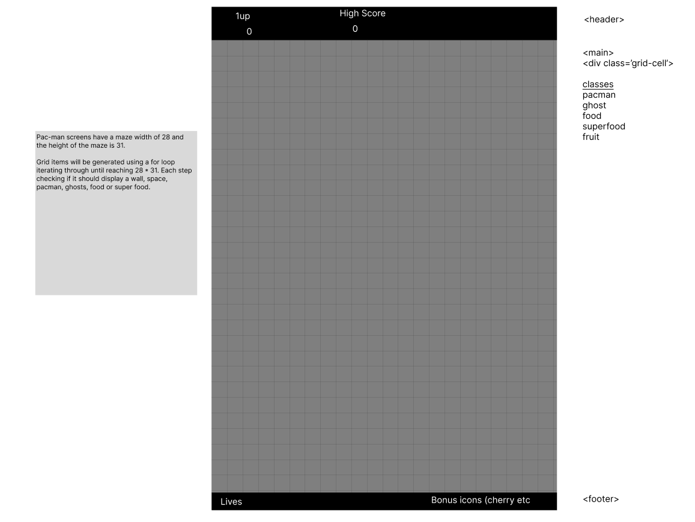
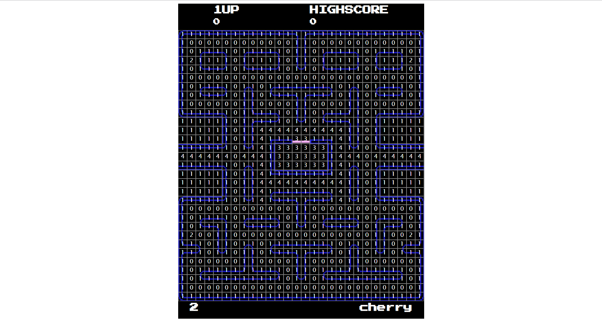
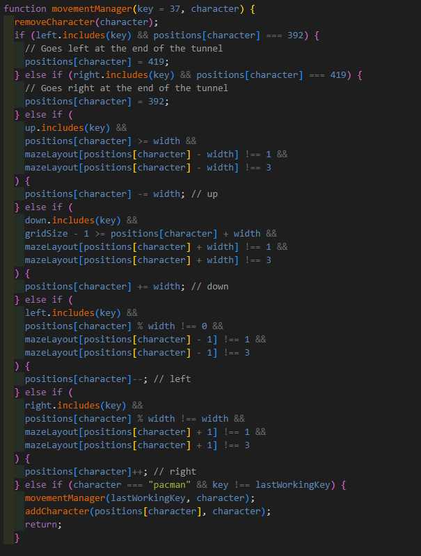
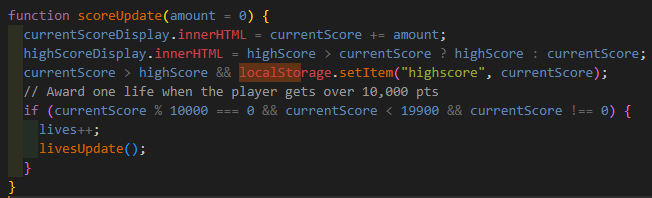
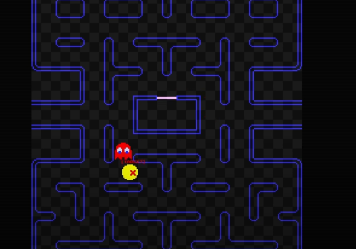
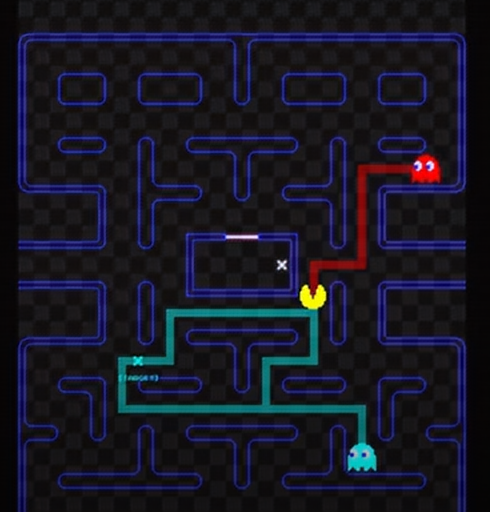
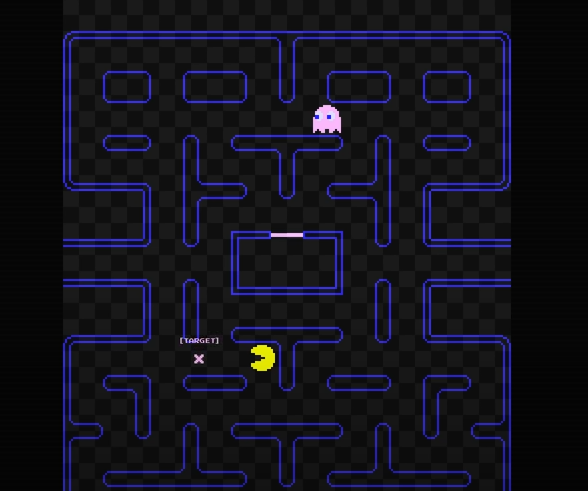
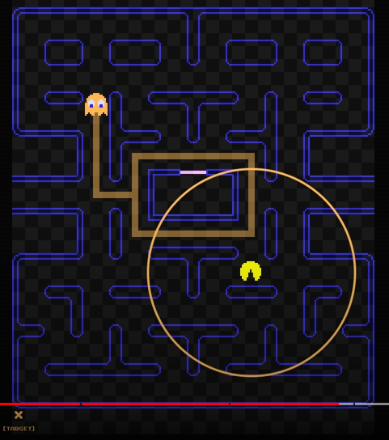
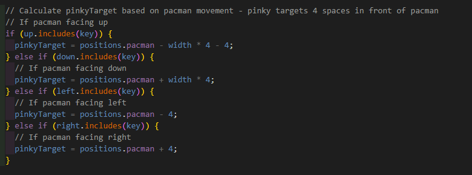
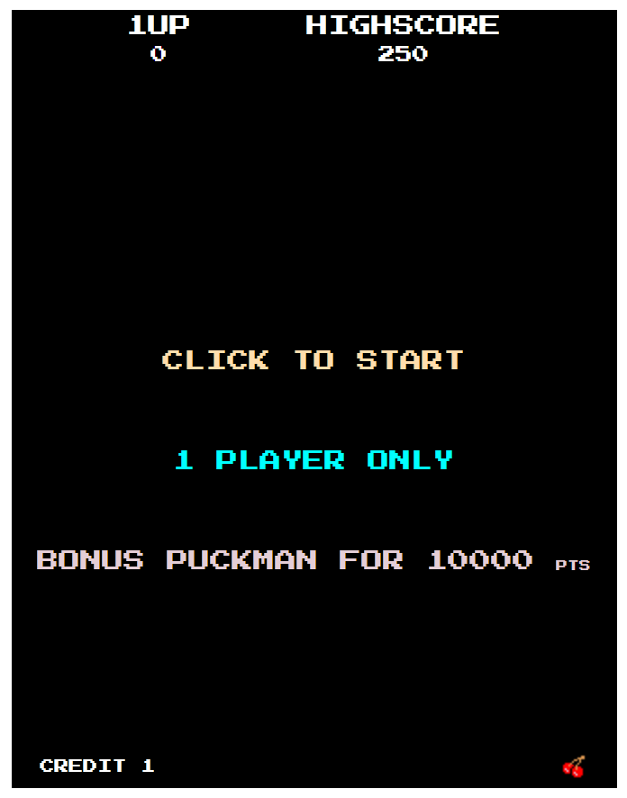

# General Assembly

Pac Man is a classic arcade game from the 80s. The player aims to eat all the food in a maze whilst being hunted by ghosts.

If the player eats special flashing food the ghosts start to flash and can now be captured by the player, sending them back to their holding pen, from where they can once again start to hunt the player.

The aim is to achieve the highest score possible before losing all your lives.

## Link to the game

[Live link to project](https://parkeralexjm.github.io/puckman-clone/)

## Overview and Concept

I was given one week to complete a grid-based game using javascript, HTML and CSS. My project is a 'faithful' reproduction of the classic Pac-man game.

## Technologies used

CSS reset from - [CSS reset - Andy Bell](https://andy-bell.co.uk/a-modern-css-reset/)

Documentary for Pacman ghost movements - [Pacman Ghost Mechanics](https://www.youtube.com/watch?v=ataGotQ7ir8&ab_channel=RetroGameMechanicsExplained)

### HTML

- Structured the scores header for player and highscores
- Central introduction splash page and container for game screens
- Footer to display lives counter and bonus fruit icons

### CSS

- Grid using flex-box
- CSS position absolute to display the ready and game over messages

### Javascript

- Keydown to move pacman
- setInterval to move pacman and the ghosts
- class to initialise ghost attributes
- audio to play/trigger sounds

## Approach taken

### Day 1

I initially created a wireframe using Figma, laying out the grid that I would use and giving some though to where I would place the score, highscore, lives counter and bonus icons. Pacman has a fairly simple and rigid layout which shows in the basic wireframing

I then built a skeleton in HTML and styled it in CSS to look similar to the wireframe and collected images for all of the elements I would need later

### Day 2

I reviewed my decision to retype every position in my mazeLayout and decided to create a map of the walls, pellets etc based on the original arcade map.

I created and styled the splash page to display the startup information and create a buffer that requires user input in order to allow audio to play. I made classes to display each of the images for the characters and other objects and made a function to move each of the characters.

### Day 3

I created basic movement functions for the ghosts that selected a random direction at each junction and prevented characters from reversing their movement. This proved to be fairly difficult and I spent some time taking a break to create highscore storage in localstorage and logic to prevent entry to the tunnels.

### Day 4

Added behaviours based on the arcade movement for the ghosts

Blinky Behaviour

Inky Behaviour

Pinky Behaviour

Clyde Behaviour

Added bonus fruit being generated after a certain number of pellets have been eaten and sounds for when the ghosts are eaten.

## Game walkthrough

### Game load / Splash screen

### Game start

### Ghost chase

### Bonus fruit

### Game over

## Key Lessons

## Challenges

## Future improvements
